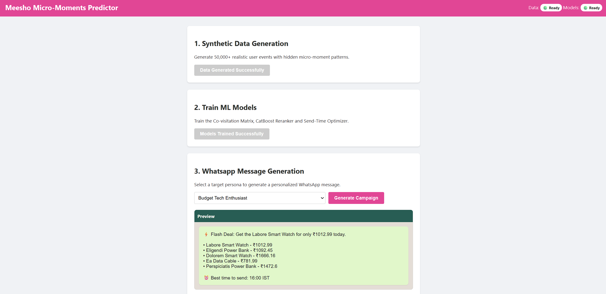

# Meesho Micro-Moments Predictor: 



An AI system designed to boost retention by delivering personalized WhatsApp campaigns. It simulates user behavior, trains recommendation models and generates optimal notification timing.

##  Models
- **Synthetic Data Engine**: Generates 50,000+ GA4-style events simulating Indian consumer behavior.
- **Hybrid Recommendation**: Uses a Co-visitation matrix for candidate generation and a CatBoost Reranker for final selection.
- **STO (Send-Time Optimization)**: Predicts the highest engagement window for specific personas (24 hour window).
- **Smart Headlines**: Rule-based headlines to craft catchy, persona-aligned marketing whatsapp messages.

## 🚀 Installation & Setup

**1. Clone the repository**
```bash
git clone [https://github.com/aryan0xo76/meesho_project2.git](https://github.com/aryan0xo76/meesho_project2.git)
cd meesho_project2
```

**2. Install dependencies**
```bash
pip install fastapi uvicorn pandas numpy scikit-learn catboost faker pydantic
```

**3. Run the Backend API**
```bash
uvicorn main:app --reload
http://localhost:3000
```